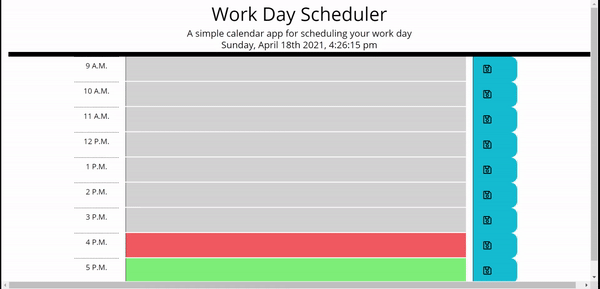
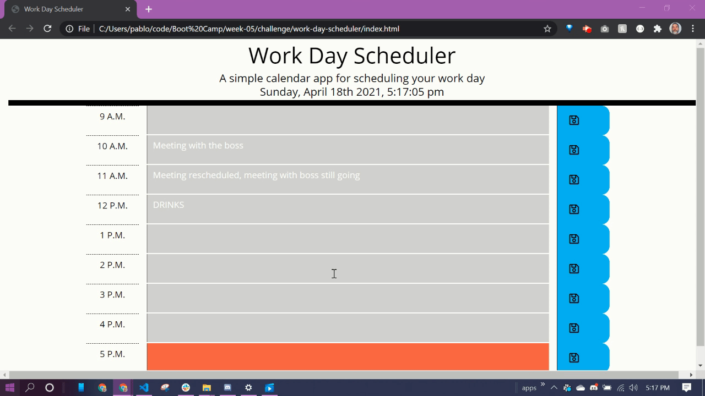

# work-day-scheduler

## Description

My application can be found by clicking the following link: https://pablodlc.github.io/work-day-scheduler/
**Work Day Scheduler** is a daily planner style application written to satisfy the _User Story_ and _Acceptance Criteria_ lovingly recreated below.

### User Story

> AS AN employee with a busy schedule  
> I WANT to add important events to a daily planner  
> SO THAT I can manage my time effectively

### Acceptance Criteria

> GIVEN I am using a daily planner to create a schedule  
> WHEN I open the planner  
> THEN the current day is displayed at the top of the calendar  
> WHEN I scroll down  
> THEN I am presented with time blocks for standard business hours  
> WHEN I view the time blocks for that day  
> THEN each time block is color-coded to indicate whether it is in the past, present, or future  
> WHEN I click into a time block  
> THEN I can enter an event  
> WHEN I click the save button for that time block  
> THEN the text for that event is saved in local storage  
> WHEN I refresh the page  
> THEN the saved events persist

## Application

Work Day Scheduler was a fun challenge. It had two challenging components: utilizing local storage and working with moment.js. In the header, I made sure the current time was displayed, updating every second. The user can click into the empty spots in the time block rows and enter tasks. Clicking the save button saves the information in the corresponding row to local storage. The `textarea`s dynamically update by time, from 9:00 A.M. to 5:00 P.M. Times earlier than the present have a gray background. If a `textarea` time block matches the current hour of the day, its background is red. If the `textarea` is in the future, the background is green. Below is a .GIF of my application in action!  

#### Bonus!

Because it seemed like a convenient feature, I included a clear button at the bottom of the page. By using a confirm, it clears local storage then reloads the page. Check it out!

## Technologies

-   HTML
-   CSS
-   Bootstrap
-   Flexbox
-   JavaScript
-   jQuery
-   moment.js
-   Font Awesome

## Future Developments

The code is not very DRY. It wasn't a problem because there weren't a lot of things to keep track of, but it's pretty repetitive. Upon my revisitation of this, I would refactor the script down to be as DRY as possible. Otherwise, it's a fun application that would only really need a broader range of hours, or stylistic changes, if desired.
